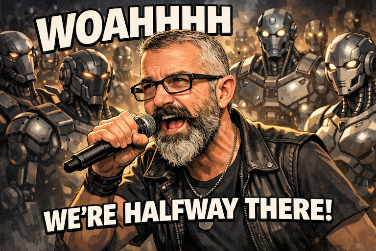

# woah, we're halfway there



🎸 woah, livin' on a prayer 🎸

day 7 of 14. we're at the midpoint. and things are looking good.

---

## what just shipped (days 6-7)

**day 6: bidi proxy server**

the websocket proxy is up. when a client connects, clicker:
1. launches a browser
2. connects to its bidi websocket
3. routes messages back and forth
4. kills the browser when the client disconnects

```
Connected to proxy
> session.status
> browsingContext.getTree
> browsingContext.navigate → https://example.com
> browsingContext.captureScreenshot
< Screenshot received! Base64 length: 20736
Disconnected from proxy
[router] Browser session closed for client 1
```

no zombie processes. clean shutdown. rock solid.

**day 7: javascript client (async api)**

the js/ts client is alive:

```typescript
import { browser } from 'vibium';

const vibe = await browser.start();
await vibe.go('https://example.com');
const shot = await vibe.screenshot();
require('fs').writeFileSync('test.png', shot);
await vibe.quit();
```

it works. actually works. spawns clicker, connects via websocket, drives chrome, takes screenshots.

**try it yourself (local dev):**

```bash
make                # build everything
cd clients/javascript && node --experimental-repl-await
```

```javascript
const { browser } = await import('./dist/index.mjs')
const vibe = await browser.start({ headless: false }) // see the browser!
await vibe.go('https://example.com')
const shot = await vibe.screenshot()
require('fs').writeFileSync('test.png', shot)
await vibe.quit()
```

---

## the stack so far

```
┌─────────────────────────────────────┐
│  your code                          │
│  const vibe = await browser.start()│
└──────────────┬──────────────────────┘
               │ spawns
┌──────────────▼──────────────────────┐
│  clicker serve (go binary)          │
│  websocket proxy on :9515           │
└──────────────┬──────────────────────┘
               │ launches + routes bidi
┌──────────────▼──────────────────────┐
│  chrome for testing                 │
│  webdriver bidi enabled             │
└─────────────────────────────────────┘
```

---

## the scoreboard

**done (days 1-7):**
- ✅ day 1: project bootstrap
- ✅ day 2: browser detection & installation
- ✅ day 3: websocket & bidi basics
- ✅ day 4: navigation & screenshots
- ✅ day 5: element finding & input
- ✅ day 6: bidi proxy server
- ✅ day 7: js client async api

**remaining (days 8-14):**
- ⬜ day 8: element class + sync api (`vibe.find('button').click()`)
- ⬜ day 9: auto-wait (no more `.sleep()` hoping elements load)
- ⬜ day 10: mcp server (claude code drives the browser)
- ⬜ day 11: error handling + logging
- ⬜ day 12-13: cross-platform packaging (npm install just works)
- ⬜ day 14: docs + examples

---

## we'll make it i swear

halfway there. on track for christmas.

the second half is where it gets fun: mcp integration means claude code can browse the web. that's when vibium becomes more than a library — it becomes infrastructure for ai agents.

stay tuned.

✨🎅🎄🎁✨

\- 🤗 hugs

#vibium

---

*december 17, 2025*
